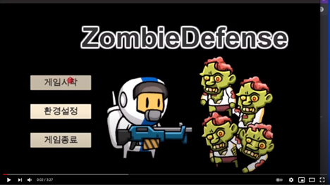

# ZombieDefence
> Unity Defence Game

밤마다 출현하는 좀비를 처치하며 최대한 오랫동안 생존하는 생존 디펜스 게임  

▼ 플레이 영상  

## 개발 환경
* 이 프로젝트는 **Unity 2019.4**를 기준으로 개발되었습니다.

## 빌드 파일 다운로드
* 윈도우  
[구글 드라이브](https://drive.google.com/file/d/1-pclmC3-QXglxgYChu_8GEwrHPIm8MnX/view?usp=sharing)

## 사용 에셋
[2D Character - Astronaut](https://assetstore.unity.com/packages/2d/characters/2d-character-astronaut-182650) 
[2D Character - Zombie](https://assetstore.unity.com/packages/2d/characters/2d-character-zombie-182669) 
[TinyHealthSystem v1.0](https://assetstore.unity.com/packages/tools/gui/tinyhealthsystem-v1-0-181303) 

## 문의
이메일 – algoribi36@gmail.com 
블로그 – https://algoribi.tistory.com/
